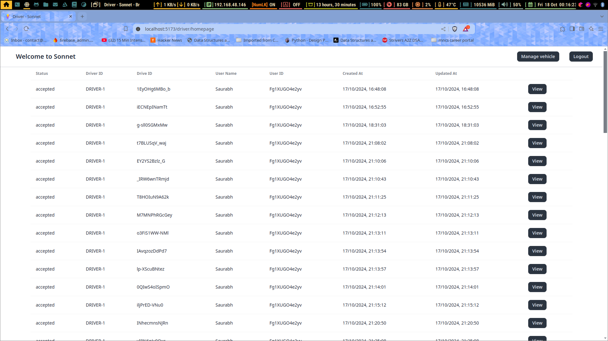
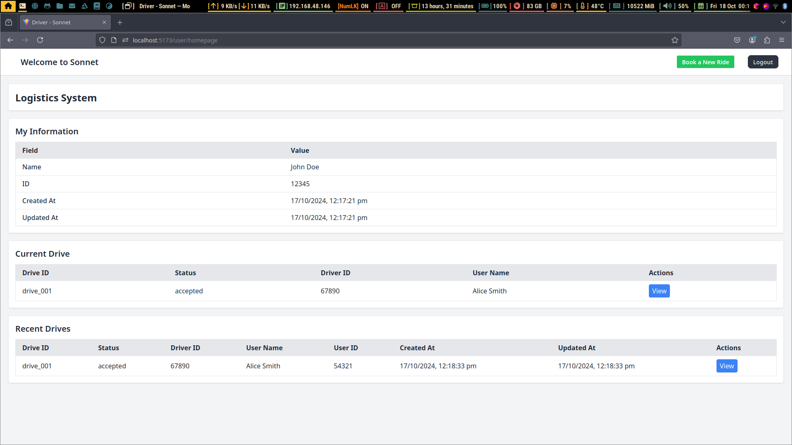
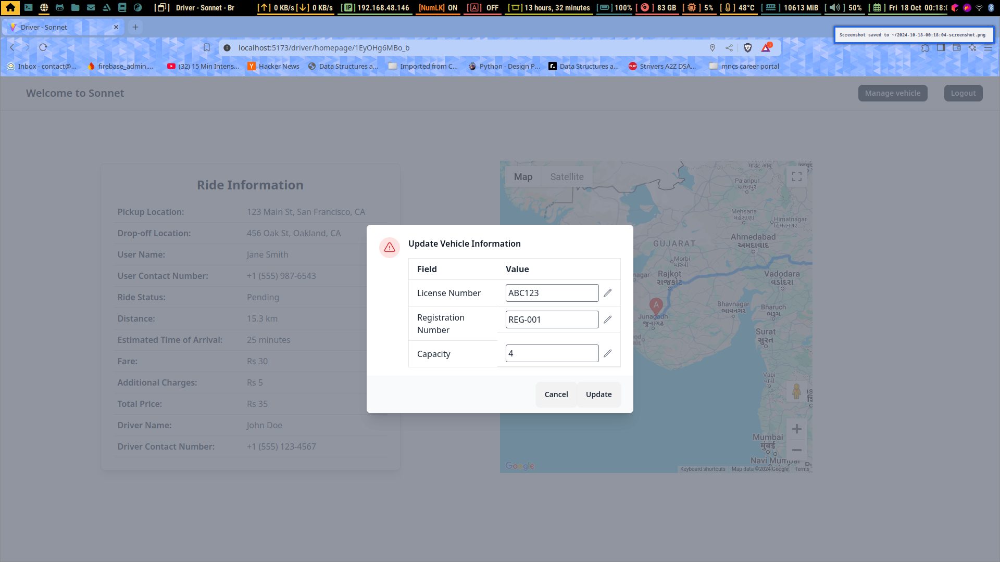
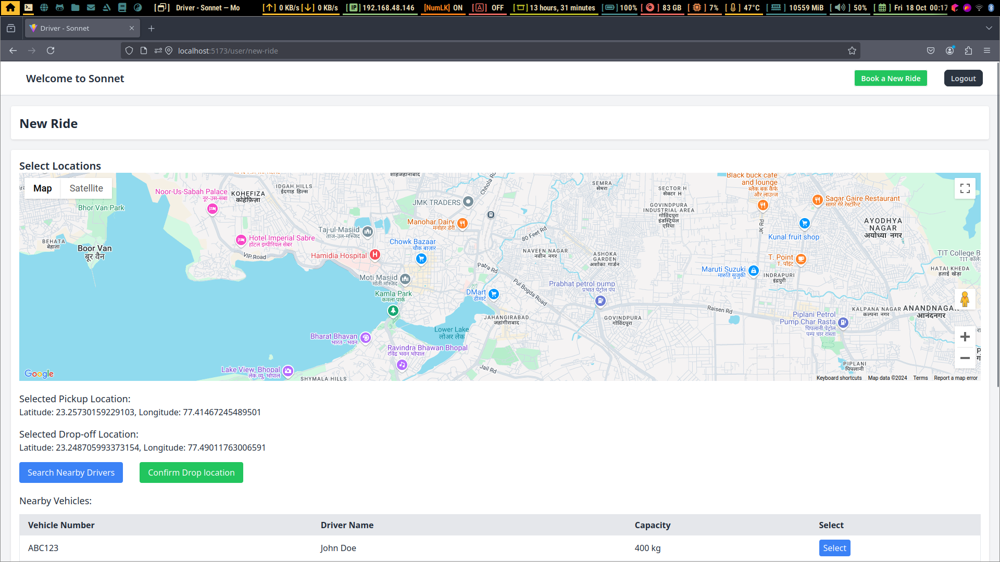
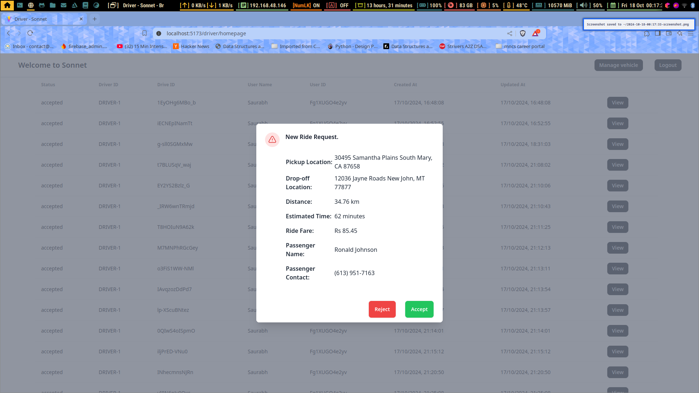
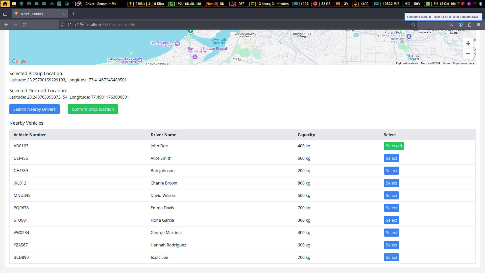
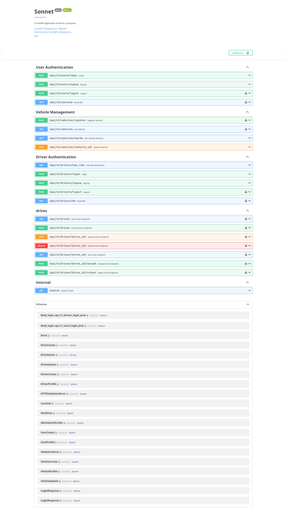
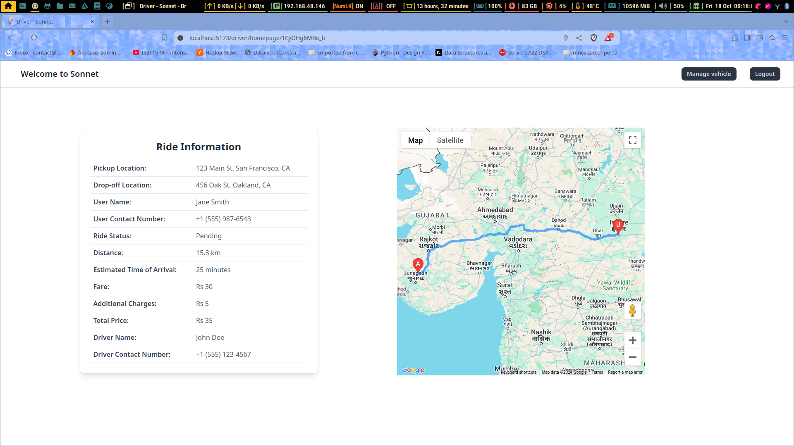

# Sonnet

##  High-Scale Logistics Platform
### Built with React, FastAPI, SQLAlchemy, PostgreSQL, DaisyUI, and Google Maps API

Sonnet is a logistics platform designed for users to ship their parcel. It leverages cutting-edge technologies to optimize delivery accuracy, real-time tracking, and notifications at scale.

##  Why Sonnet Stands Out
- **Enterprise-Level Scalability:** Supports **50M+ users** with **99.9% uptime** and **200ms response times**.
- **Advanced Location Optimization:** Integrates **Google Maps API**, reducing address errors by **75%** and improving delivery precision by **40%**.
- **Real-Time Tracking:** Handles **10M+ daily updates** with **99.9% accuracy**, minimizing delivery disputes by **60%**.
- **Lightning-Fast Notifications:** Processes high-volume alerts in **100ms latency**, increasing driver response rates by **45%**.

##  Tech Stack
- **Frontend:** React, DaisyUI, Google Maps API
- **Backend:** FastAPI, SQLAlchemy, PostgreSQL
- **Security:** OAuth2 authentication
- **Infrastructure:** Optimized for high performance and real-time processing
## ScreenShots
| Driver Interface | User Interface| 
|--------|-----|
| ||
|||
|||
|||
##  Project Structure
```
Sonnet/
├── backend/    # FastAPI backend 
├── frontend/   # React frontend 
```

## Quick Setup
### Backend
```sh
cd backend
python -m venv venv
source venv/bin/activate  # Windows: `venv\Scripts\activate`
pip install -r requirements.txt
uvicorn main:app --reload
```

### Frontend
```sh
cd frontend
npm install
npm start
```


